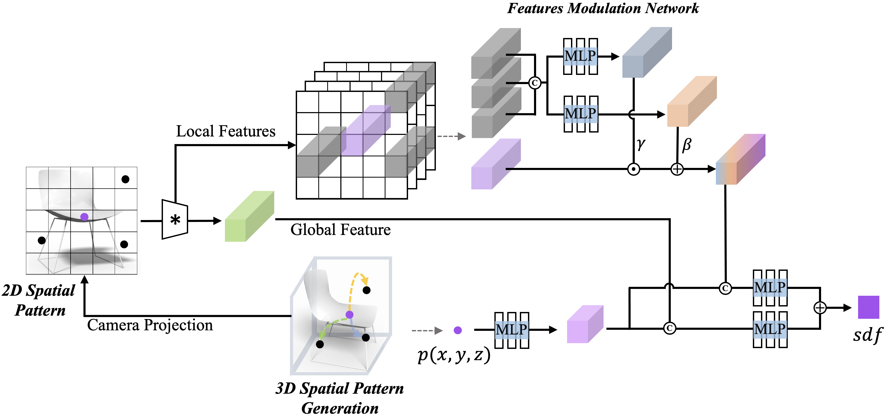

## Neural Implicit 3D Shapes from Single Images with Spatial Patterns

This repository provides PyTorch implementation of our paper:

[Neural Implicit 3D Shapes from Single Images with Spatial Patterns](https://arxiv.org/abs/)


### Prerequisites
- Python 3.6
- CPU or NVIDIA GPU + CUDA CuDNN
- Pytorch > (1.4.x)

Install dependencies:
```bash
pip install -r requirements.txt
```

### Run

For a quick demo, please use the pre-trained model. The pretrained model can be downloaded from [Google Drive](https://drive.google.com/drive/..).

```bash
python test.py -i test/a.png -o test/a.obj --batch_size 4 -g 0,1 
```
The option `-i` and `-o` dictates the input and output path respectively.

For generating all the testing samples from a category of ShapeNet Core Dataset, e.g., Chair, please use

```bash
python sdf2obj.py --category chair --ckpt xxx --batch_size 4 -g 0,1
```


### Method  - Spatial Patterns



