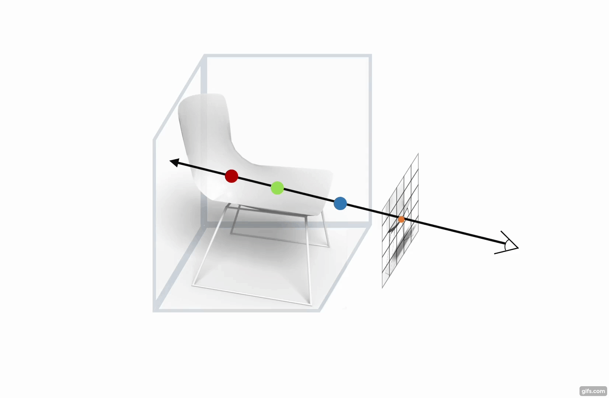
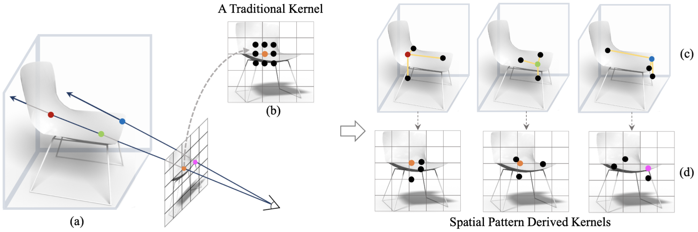
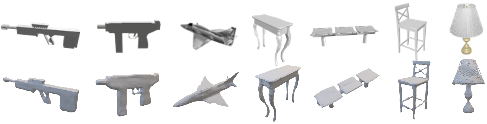
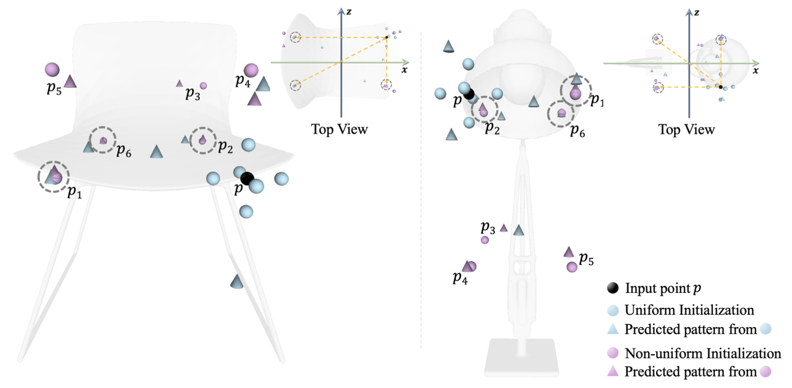

<br><br><br>

## Neural Implicit 3D Shapes from Single Images with Spatial Patterns

This repository contains the code for the paper "[Neural Implicit 3D Shapes from Single Images with Spatial Patterns](https://yixin26.github.io/projects/Spatial-Pattern/Spatial_Pattern.pdf)".





### Installation
- Clone this repo:
```bash
git clone https://github.com/yixin26/SVR-SP.git
cd SVR-SP & cd code
```

#### Prerequisites
- Python 3.6
- CPU or NVIDIA GPU + CUDA CuDNN
- Pytorch > (1.4.x)

#### Install dependencies
Install via conda environment `conda env create -f environment.yml` (creates an environment called `spatial_pattern`)





### Run

For a quick demo, please use the pre-trained model. Please download the model from [Google Drive](https://drive.google.com/file/d/1gLNrlg0NLG6VndslWMTRZqU6ZqV9P-ax/view?usp=sharing),
and exact the model to ```code/all/model```.
For generating all the testing samples from a category of ShapeNet Core Dataset, e.g., Chair, please use

```bash
python sdf2obj.py --category chair --ckpt 30 --batch_size 4 -g 0,1
```
The generated mesh files will be stored at  ```code/all/results/30/test_objs/...```. 

To train the model from scratch, please use
```bash
python train.py --category all --exp all -g 0,1 --batch_size 20 --nr_epochs 30
```

#### Dataset preparation
To prepare SDF files, images and cameras, we use the code from [preprocessing](https://github.com/laughtervv/DISN/tree/master/preprocessing). 
To generate meshes from predicted SDFs, we use the executable file from [isosurface](https://github.com/laughtervv/DISN/tree/master/isosurface).

During training, we use Furthest Point Sampling algorithm to downsample the input point cloud. Please download and compile the code from [sampling_cuda](https://github.com/daerduoCarey/pt2pc/tree/master/sampling).


### Visualization


Please use the trained model to generate spatial patterns. The visualization codes and materials can be found at folder ```code/visualization/```.


### Cite

Please cite our work if you find it useful:

```
@article{zhuang2021neural,
  title={Neural Implicit 3D Shapes from Single Images with Spatial Patterns},
  author={Zhuang, Yixin and Liu, Yunzhe and Wang, Yujie and Chen, Baoquan},
  journal={arXiv preprint arXiv:2106.03087},
  year={2021}
}
```
