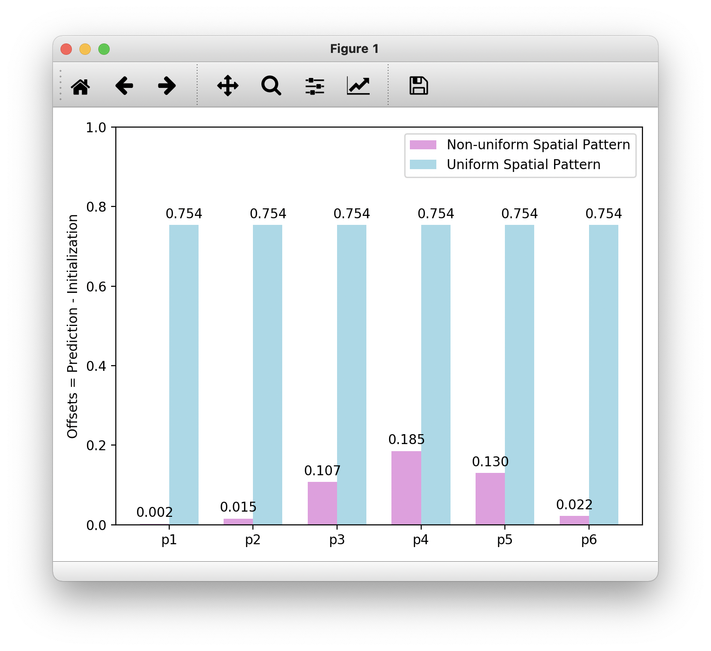
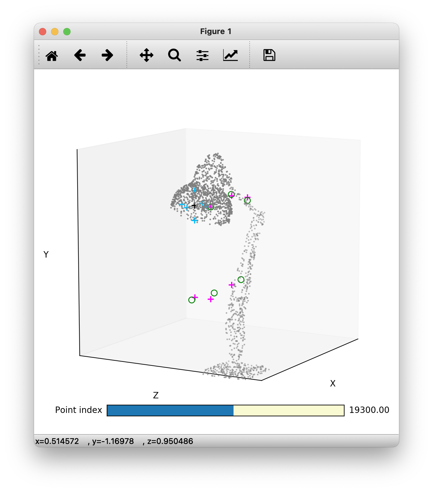

#### Generate Spatial Pattern
```bash
python visualization/get_sp.py --category all --exp_name all --batch_size 1 --ckpt 30 -g 0
```
The file will be saved to ```spatial_pattern_30.npy```.

#### Visualization
```bash
python vis.py
```





Move the slider to see different patterns.